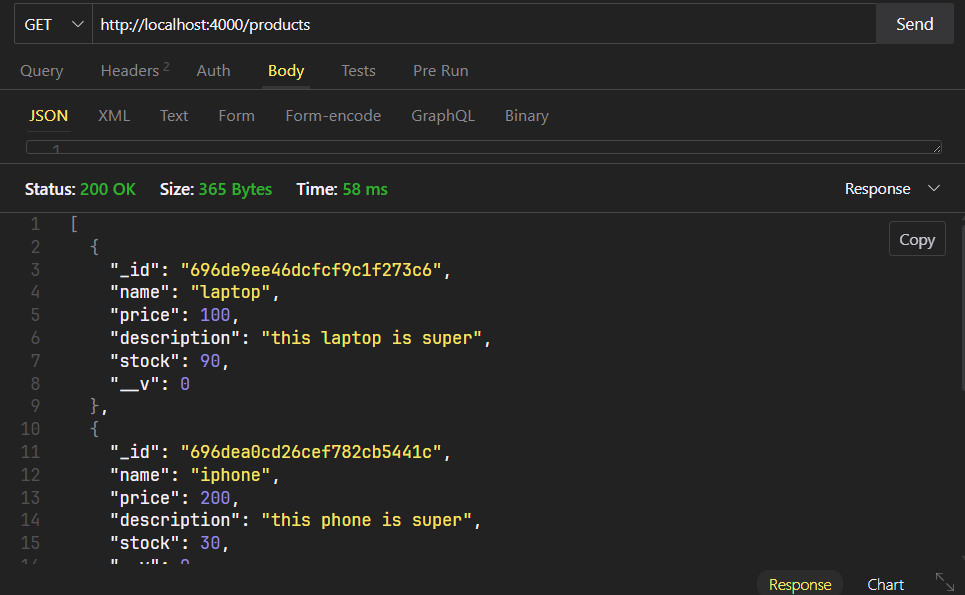
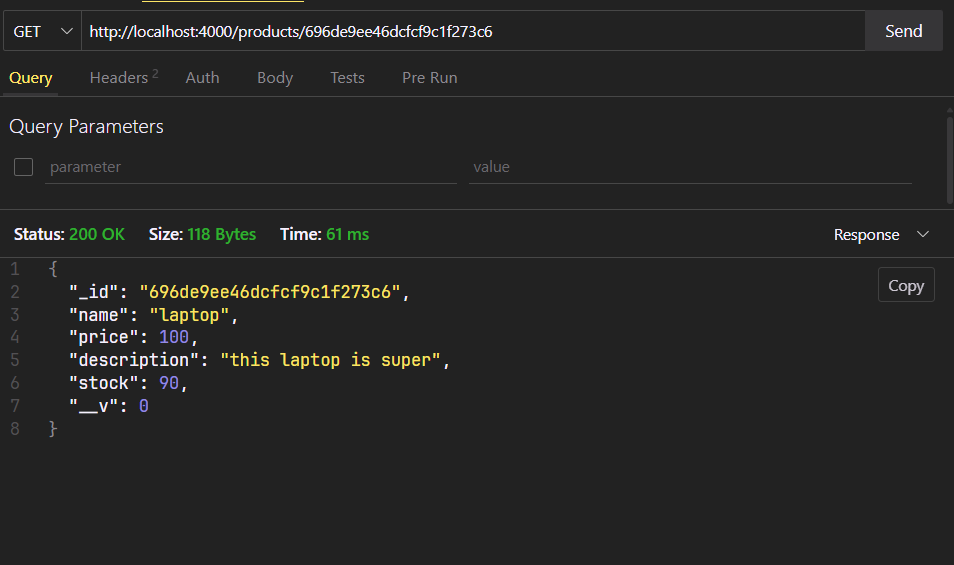
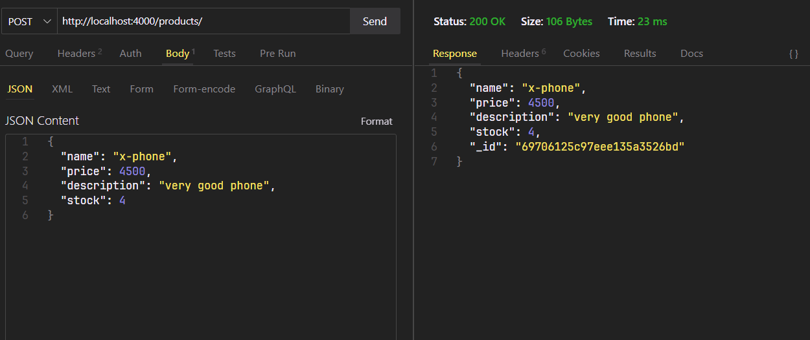
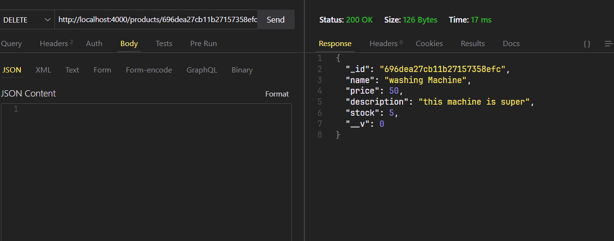
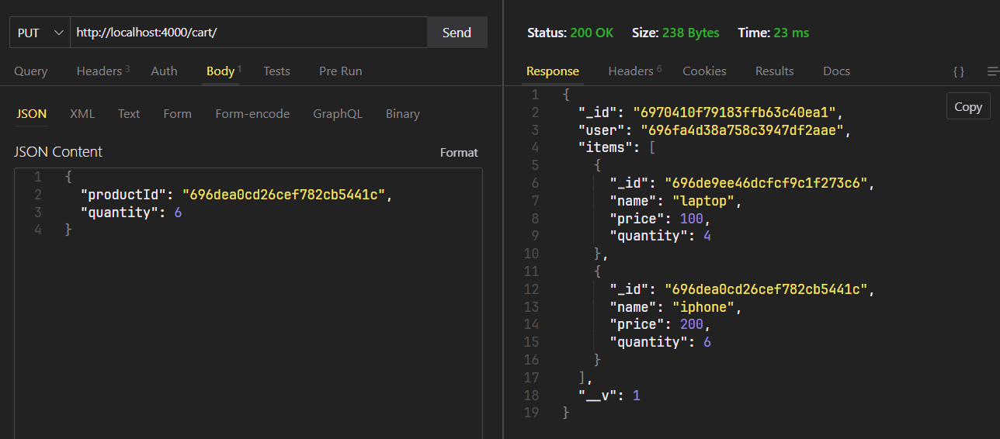
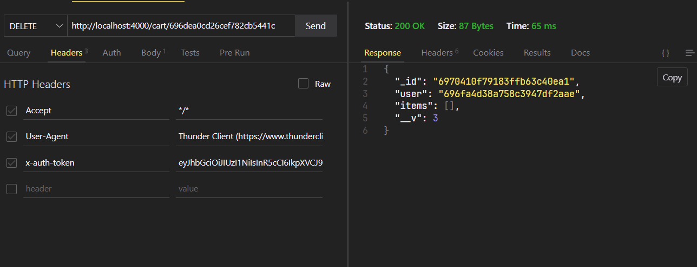

## API Testing Screenshots

### ThunderClient Tests

#### products
``` 
GET  - http://localhost:4000/products
```


``` 
GET  - http://localhost:4000/products/:id
```


``` 
POST  - http://localhost:4000/products/
```


```
DELETE  - http://localhost:4000/products/:id
```



#### carts
``` 
POST - http://localhost:4000/cart/
```


``` 
PUT - http://localhost:4000/cart/
```


``` 
DELETE - http://localhost:4000/cart/:id
```



### MongoDB Collections

