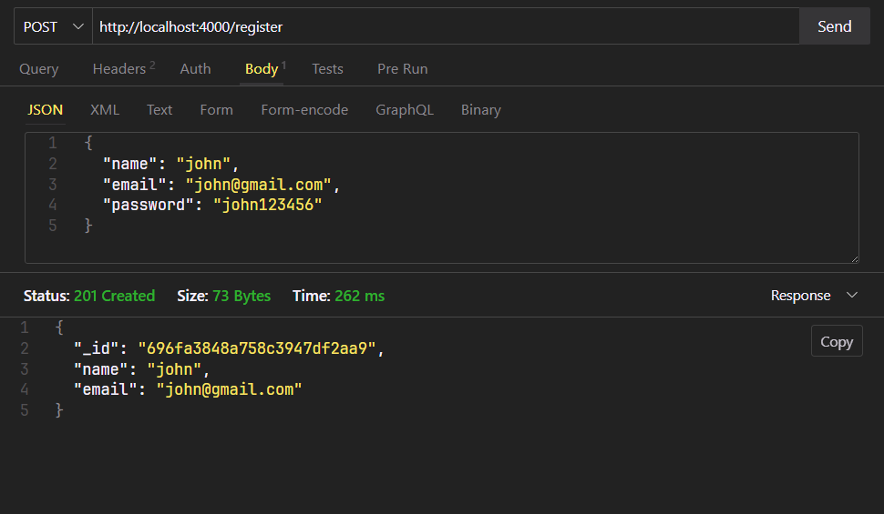
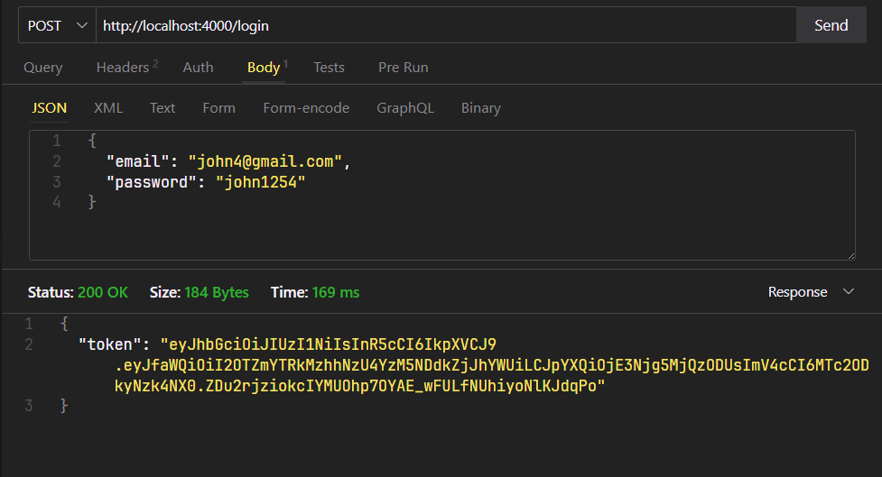
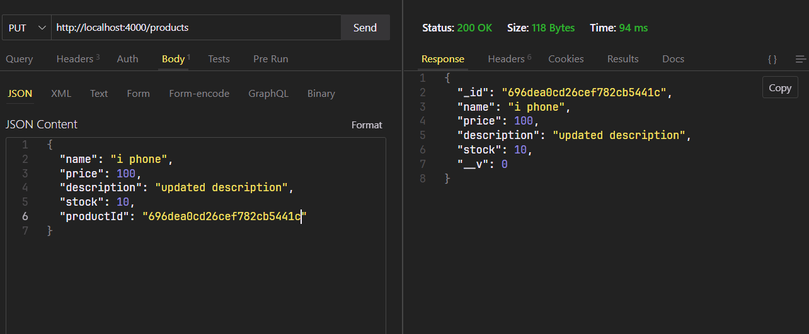
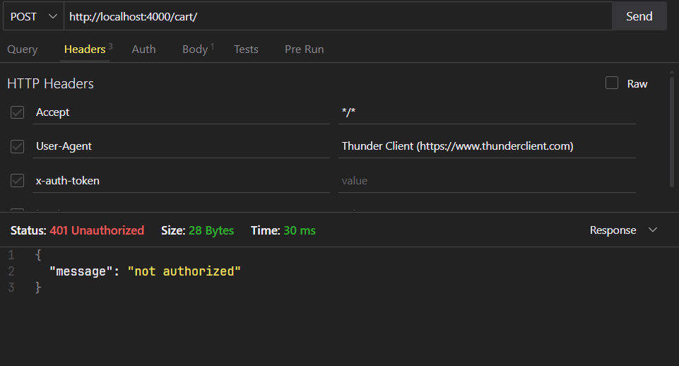
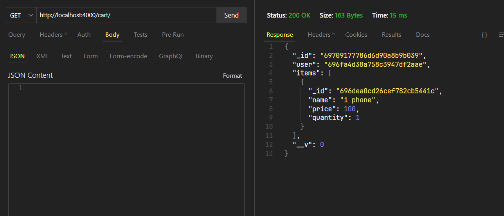
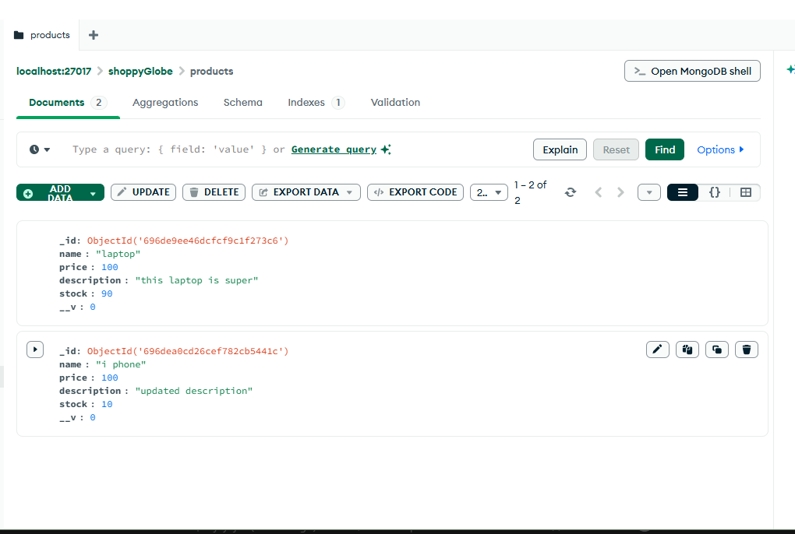
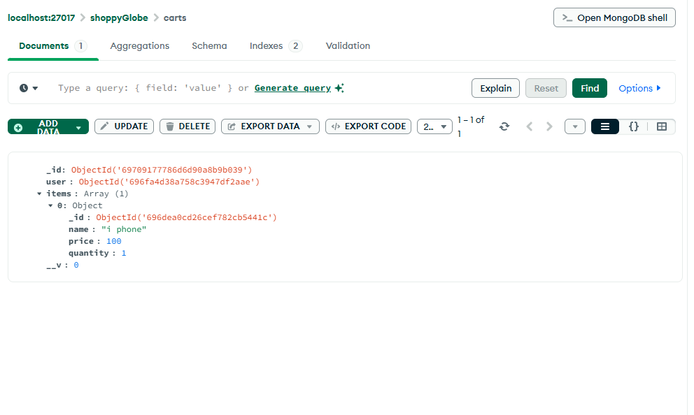

# 🛒 ShoppyGlobe – Node.js REST API

Backend REST API for the **ShoppyGlobe E-commerce Application** built using **Node.js, Express.js, MongoDB, and JWT authentication**.


## ▶️ How to Run the Application

By default, the server runs on **port 4000**.

If the application throws a port-related error, try changing the port number in the `index.js`.

1. Clone the repository  
   `git clone <https://github.com/ajeyajaz/shoppyGlobe-E-commerce-backend.git>`

2. Install dependencies  
   `npm install`

3. write
    `node index.js`


## 🔐 Authentication Note

**NOTE:** Cart routes are protected.

Include JWT token in request header using this format:

x-auth-token: <JWT_TOKEN>


# API Testing Screenshots

## ThunderClient Tests
 
## users
``` 
POST  - http://localhost:4000/register
```


``` 
POST  - http://localhost:4000/login
```



## products
``` 
GET  - http://localhost:4000/products
```


``` 
GET  - http://localhost:4000/products/:id
```


``` 
POST  - http://localhost:4000/products/
```


``` 
PUT  - http://localhost:4000/products/
```


```
DELETE  - http://localhost:4000/products/:id
```


## carts -- protected routes

``` 
GET - http://localhost:4000/cart/
```



## carts

``` 
GET - http://localhost:4000/cart/
```


``` 
POST - http://localhost:4000/cart/
```


``` 
PUT - http://localhost:4000/cart/
```


``` 
DELETE - http://localhost:4000/cart/:id
```


## MongoDB Collections


``` 
USERS-COLLECTION
```



``` 
PRODUCTS-COLLECTION
```


``` 
CARTS-COLLECTION
```

